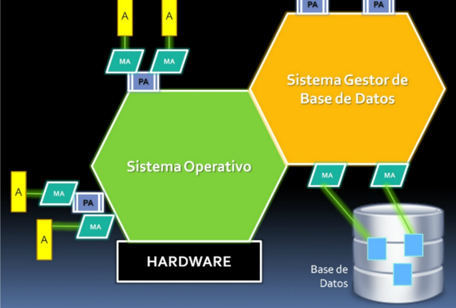
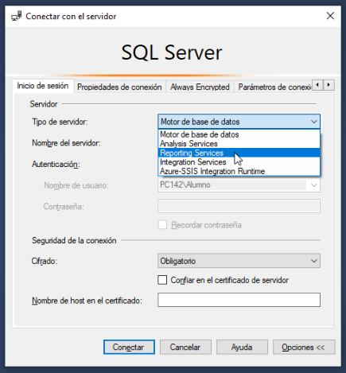
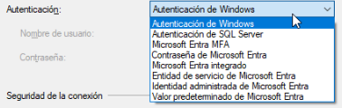
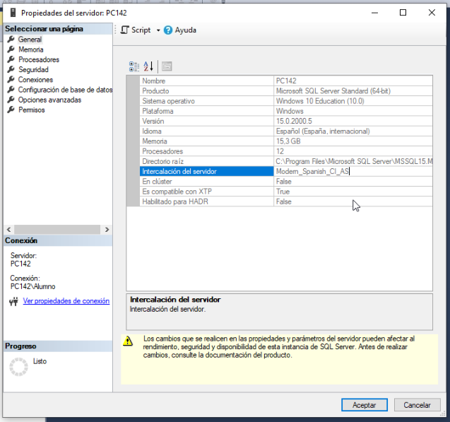
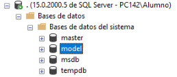

# Base de Datos I - Notas de clase - 2025
Notas de clase en Base de Datos 2025.  

Alumno: Sebastián Alejo Markoja  
Profe: Esteban Lopez Belcuore

## Clase 1
*18/08/25*  
DVA es el que controla la base de datos.  

SQL DDL (de definición), DML (de manipulación) y DCL (de control).  

T-SQL (Microsoft sql server), PL-SQL (oracle) o P-SQL (MySQL). Son lenguajes de 4ta generación, que admiten otros lenguages, como por ej SQL.  

* Hoy en día, el sector de **desarrollo** de código está siendo achicado por el avance de las IAs, por ejemplo globant prefiere Prompters o analistas de desarrollo para aprovechar la nueva tecnología. 
* Un nuevo campo que se está ampliando es la **ciberseguridad** ya que la tecnología tiene cada vez más protagonismo en la vida de las personas.  

Necesitamos el SQL Server Express edition. 2022 o 2019. Luego en BD2 se usa la versión Developer.  


- PA programa aplicación
- MA métodos de acceso
- A archivos  
SGBD son motores de base de datos. DBMS.  
Un motor de BD funciona sobre un sistema operativo, en segundo plano. Al usuario no le interesa donde son guardados los datos, solo necesita consultarlos.  

## Clase 2
*20/08/25*  

Abrimos consola de Servicios en windows. SQL Server Management Studio es el PA (programa de aplicación) que accede y controla el motor de SQL Server. Vemos los tipos de servidores que el programa dispone.
Es importante corroborar que el servicio MSSQLSERVER esté corriendo para hacer funcionar el motor de BD en el managment studio.  

Integration services sirven para integrar sistemas entre sí. Por ejemplo si un dato se carga en un sistema con Tango, y lo mismo se quiere registrar en otro sistema con SAP.  
Azure es el cloud de Microsoft.  
Luego vemos los tipos de Autenticación.  
  

SA (system admin) => privilegio de sys Admin. Esto sucede cuando ponemos autenticación de SQL server, que no puede tomar todas las medidas de seguridad del SO local.  
Cifrado Opcional u Obligatorio está bien, pero en el último caso hay que poner confiar en el certificado de servidor.
Ahora vamos a las propiedades del servidor que hemos creado.  
  
La intercalación es importante, segun la zona y los caracteres que son usados en cada idioma. En este caso tenemos Español, Mayúsculas Insensitivo y Acentos Sensitivo.  
  
Estas bases de datos que vienen con la instancia, master es la mas importante, tiene todos los permisos y métodos para el correcto funcionamiento. Model es como una plantilla que se puede personalizar. Msdb es para el procesamiento posibilita las automatizaciones. Tempdb tiene todos los datos temporales.  
Master tiene vistas por defecto, por ejemplo en sys.databases, registra todas las las db.  
Luego en Seguridad/Inicios de sesión están todos los usuarios habilitados, como por ejemplo el SA.  
TOAD en Oracle.  
Una vista es como una tabla que **no está almacenada**, es una herramienta para hacer un select sin tener que elaborar el mismo, por ello es muy utilizado por personas sin conocimiento de SQL.  
Con el Sistema SQL server **Express** no tendremos problemas de licenciamiento, como en otra versión. Es importante tenerlo en cuenta a la hora de hacer software profesional.  

## Clase 3
*20/08/25*  

Vemos una BD ya hecha mediante un DER. Es importante ver y tratar de entender como funciona antes de trabajar con la misma.   
Cuando vemos el tipo decimal(9,2), significa que siete dígitos serán enteros y los últimos dos serán decimales.  
```SQL
CREATE
ALTER
DROP
```
La ingeniería directa es crear un sistema u objeto a partir de un conjunto de un criterio, y la ingeniería inversa, por lo contrario, trabaja hacia atrás descomponiendo algo ya existente para entender su estructura, con el objetivo de documentarlo, mejorarlo o replicarlo. 
.ldf log de transacción  
.mdf   
Estos pertenecen a la tabla primary.

## Clase 4
*20/08/25*  

## Clase 5
*20/08/25*  
