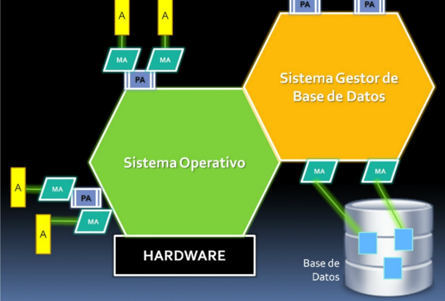

# Base de Datos I - Notas de clase - 2025

Alumno: Sebastián Alejo Markoja  
Profe: Esteban Lopez Belcuore

## Primera Clase
DVA es el que controla la base de datos.  

SQL DDL (de definición), DML (de manipulación) y DCL (de control).  

T-SQL (Microsoft sql server), PL-SQL (oracle) o P-SQL (MySQL). Son lenguajes de 4ta generación, que admiten otros lenguages, como por ej SQL.  

* Hoy en día, el sector de **desarrollo** de código está siendo achicado por el avance de las IAs, por ejemplo globant prefiere Prompters o analistas de desarrollo para aprovechar la nueva tecnología. 
* Un nuevo campo que se está ampliando es la **ciberseguridad** ya que la tecnología tiene cada vez más protagonismo en la vida de las personas.  

Necesitamos el SQL Server Express edition. 2022 o 2019. Luego en BD2 se usa la versión Developer.  

- PA programa aplicación
- MA métodos de acceso
- A archivos  
SGBD son motores de base de datos. DBMS.  
Un motor de BD funciona sobre un sistema operativo, en segundo plano. Al usuario no le interesa donde son guardados los datos, solo necesita consultarlos.  

